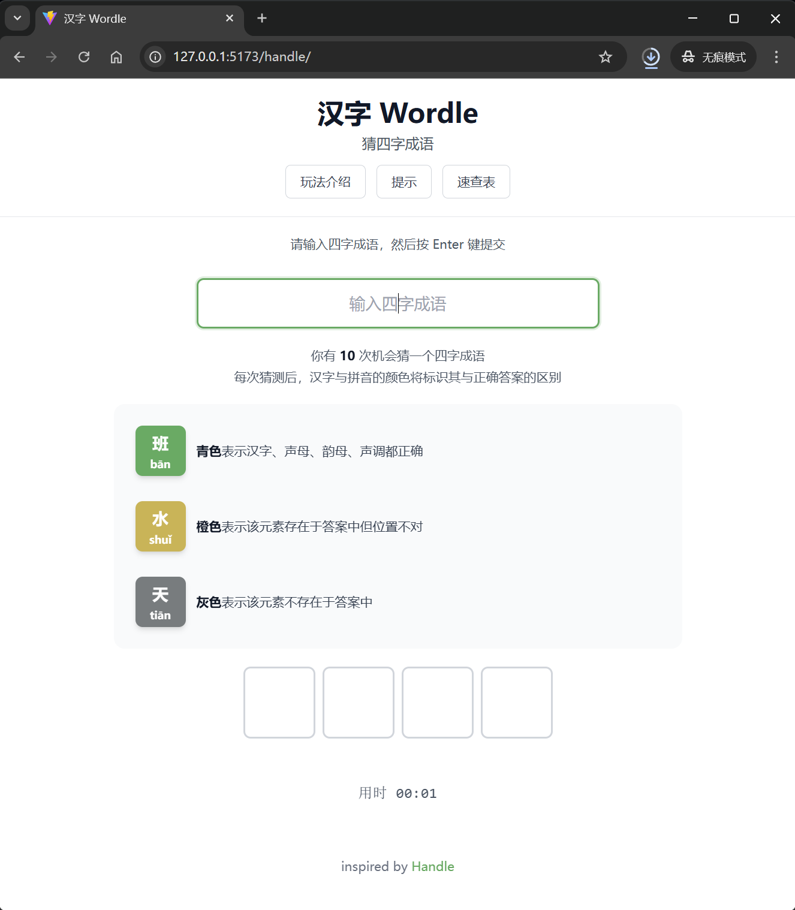
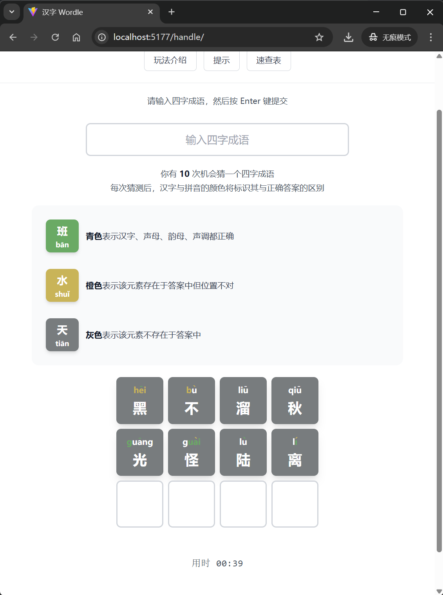
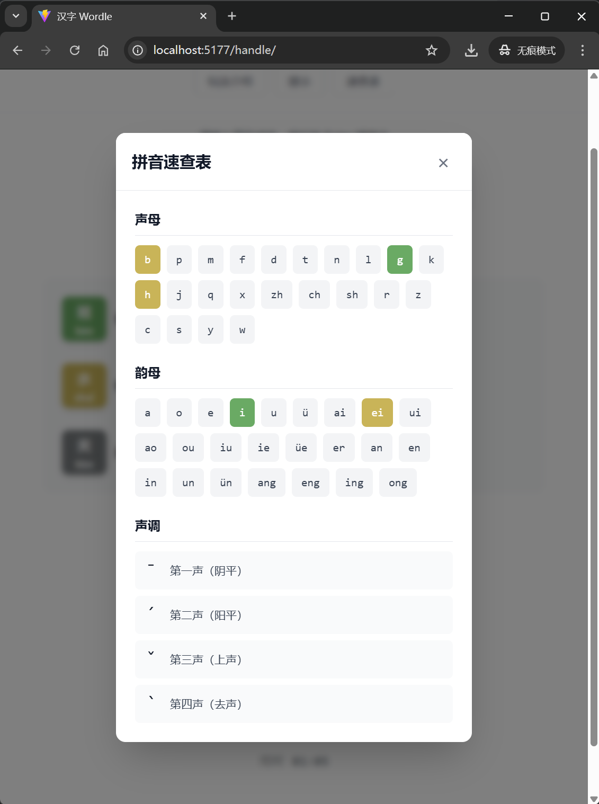
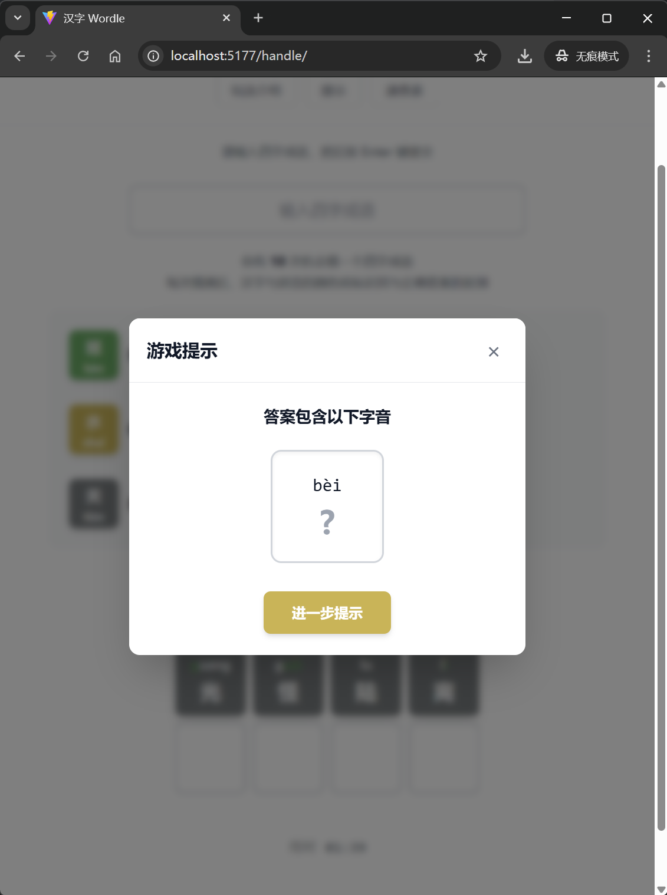
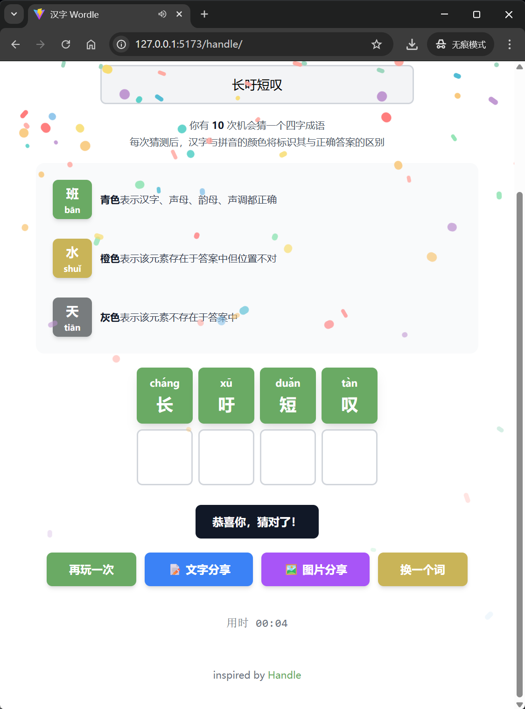
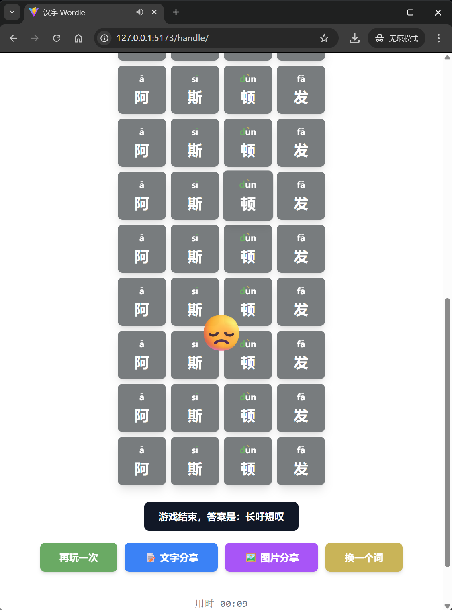

# 四字成语猜词游戏

> 一个基于 React + TypeScript 的中文互动猜词项目，灵感来自 handle.antfu.me。

一个基于 Vite + React + TypeScript 实现的互动字词游戏网页项目，围绕输入反馈、拼音提示、提示系统、分享能力和通关反馈，尽量把它做成一个可展示、可讲述、可继续迭代的作品；当前已完成 GitHub Pages 部署，并支持 PC / 手机端访问。


## 项目预览
| 类型 | 链接 |
| --- | --- |
| 仓库地址 | [Panzimon/handle](https://github.com/Panzimon/handle) |
| 在线体验 | [https://panzimon.github.io/handle/](https://panzimon.github.io/handle/) |
| 动态演示 | [docs/demo.gif](./docs/demo.gif) |
| 状态截图 | `docs/origin_status.png` / `docs/playing_status.png` / `docs/playing_status_cheatSheet_modal.png` / `docs/playing_status_tips_modal.png` / `docs/success_status.png` / `docs/fail_status.png` |
| 架构图 | [docs/architecture.svg](./docs/architecture.svg) |

> 当前项目已完成 GitHub Pages 部署，线上地址可直接访问，且已确认支持桌面端与移动端游玩。
>
> 仓库展示素材也已经补齐为：**1 段 Demo GIF + 6 张关键状态截图 + 1 张架构图**，足够用于仓库展示、项目复盘。

## 快速亮点
- **完整交互链路：** 输入、校验、提示、拼音反馈、分享与完成态反馈形成闭环。
- **中文玩法有辨识度：** 不只判断汉字本身，还细化到声母、韵母、声调反馈。
- **体验细节较完整：** 包含提示系统、拼音速查表、动画、音效、文字/图片分享。
- **作品化程度较高：** 已上线、可访问、可展示，可作为项目案例。


## 视觉展示

### 动态演示

> 这段演示已经覆盖核心玩法，并包含分享功能，能直接展示项目的完整交互闭环。


### 关键状态截图

<table>
  <tr>
    <td align="center"><strong>初始状态</strong></td>
    <td align="center"><strong>正在猜词</strong></td>
  </tr>
  <tr>
    <td></td>
    <td></td>
  </tr>
  <tr>
    <td align="center"><strong>打开速查表</strong></td>
    <td align="center"><strong>打开提示</strong></td>
  </tr>
  <tr>
    <td></td>
    <td></td>
  </tr>
  <tr>
    <td align="center"><strong>成功状态</strong></td>
    <td align="center"><strong>失败状态</strong></td>
  </tr>
  <tr>
    <td></td>
    <td></td>
  </tr>
</table>

## 项目简介
本项目灵感来自 [handle.antfu.me](https://handle.antfu.me/)。

目标不是机械复刻页面，而是完整走通一次交互型前端项目的实现过程：从玩法拆解、状态设计、输入处理，到拼音反馈、提示引导、分享能力和体验打磨，最终沉淀成一个适合长期展示、继续迭代和复盘实现过程的项目作品。

## 项目价值
- **完整交互链路。** 覆盖输入、校验、提示、拼音反馈、分享与完成态反馈，不是纯静态页面练习。
- **有真实问题闭环。** 核心价值不只是“做出来”，还包括把输入状态、拼音提示和界面反馈串稳定。
- **有作品化表达。** 既能展示 React + TypeScript 实战，也能讲清楚实现思路、问题定位和体验补齐过程。
- **有继续扩展空间。** 计时、分享、提示、词库等能力都具备继续迭代的基础。

## 功能亮点

### 🎮 核心玩法与反馈
- **四字成语猜词玩法：** 以四字词语为核心目标，玩家需要在限定次数内完成猜测。
- **10 次挑战机会：** 每次提交都会更新整行结果，逐步缩小答案范围。
- **多维度反馈机制：** 不只判断汉字本身，还会同时给出声母、韵母、声调的反馈。
- **胜负状态完整：** 覆盖成功通关、挑战失败、重新开始、换词继续等完整流程。
- **过程体验补齐：** 包含计时、动画、音效、提示文案等细节，增强游戏过程的反馈感。

### ✨ 扩展能力
- **分级提示系统：** 在卡关时提供额外信息，兼顾可玩性和引导性。
- **拼音速查表：** 帮助理解声母、韵母与声调的判定逻辑，降低上手门槛。
- **分享能力：** 支持文字分享与图片分享，方便记录结果或对外展示。
- **响应式适配：** 在桌面端与移动端都能正常体验完整流程。
- **测试覆盖：** 使用 Jest + Testing Library 覆盖关键交互与核心逻辑。
- **展示素材完整：** 仓库已包含 Demo GIF、关键状态截图和架构图，方便快速理解项目能力。

## 游戏规则

1. 玩家需要在 **10 次机会** 内猜出当天的目标四字词语。
2. 每次输入后，系统会从 **汉字、声母、韵母、声调** 四个维度给出反馈。
3. 颜色反馈规则如下：
   - **青色：** 当前位置内容正确，且位置也正确。
   - **橙色：** 内容存在于答案中，但当前位置不正确。
   - **灰色：** 该内容不在答案中。
4. 如果输入不符合规则，页面会通过提示信息进行拦截与反馈。
5. 玩家可以在需要时使用提示功能，但这会成为一次带辅助信息的通关过程。
6. 游戏结束后可以查看结果，并通过文字或图片形式分享本次挑战。

## 核心交互流程
输入反馈 → 拼音着色 → 结果校验 → 提示辅助 → 分享结果 / 通关反馈

这个流程基本覆盖了项目最值得展示的交互链路，也是 README、项目复盘和功能说明里最适合展开讲的部分。

## 技术栈
- **Vite：** 本地开发与构建。
- **React：** 组件拆分与状态驱动界面。
- **TypeScript：** 约束数据结构与交互逻辑。
- **Jest + Testing Library：** 覆盖核心逻辑与交互测试。
- **pinyin：** 汉字拼音拆解与反馈处理。
- **html-to-image / html2canvas：** 图片分享能力支持。

## 核心功能实现

### 1. 游戏状态与流程控制
核心逻辑主要集中在 `useGame.ts` 中，负责管理整个游戏生命周期，包括：
- 生成或切换目标词语。
- 管理当前输入、历史猜测和网格数据。
- 处理提交逻辑、胜负状态和重新开始流程。
- 控制计时器、提示使用状态等衍生信息。

### 2. 拼音反馈计算
`pinyin.ts` 负责对汉字进行拼音拆解，并将结果细化为：
- **声母**
- **韵母**
- **声调**

这样每次猜测后，界面不只是显示“字对不对”，还能展示更细粒度的拼音反馈，形成这个项目相对特别的交互层次。

### 3. 输入校验与界面反馈
项目在输入阶段做了比较完整的校验和反馈处理，包括：
- 非法输入拦截。
- 输入过程提示。
- 提交后的结果着色。
- 错误提示、震动反馈和状态切换。

这部分是体验上的关键，因为它直接决定用户是否能快速理解规则并持续玩下去。

### 4. 提示系统与辅助信息
除了基础猜词外，项目还加入了提示系统与拼音速查表：
- 提示系统用于在玩家卡住时提供额外线索。
- 拼音速查表用于降低理解拼音反馈机制的门槛。

这让项目不只是“会判题”，而是进一步兼顾了引导和可用性。

### 5. 分享功能
分享能力由 `utils/share.ts` 和 `utils/imageShare.ts` 提供，主要包括：
- 生成文字版挑战结果。
- 复制分享文本到剪贴板。
- 生成图片形式的分享内容。

这部分让项目从单纯的页面练习，延伸成一个更完整的互动作品。

### 6. 测试覆盖
项目使用 Jest 与 Testing Library 对关键逻辑和交互进行覆盖，包括：
- 游戏主流程。
- 输入校验。
- 拼音处理。
- 组件交互与弹窗逻辑。

测试的价值不只是“证明能跑”，更重要的是帮助项目在持续调整交互时保持稳定。

## 项目特点
- **🧩 交互链路完整：** 从输入、反馈到分享，形成相对完整的闭环。
- **🈶 拼音维度有辨识度：** 相比普通猜词游戏，多了一层中文语义与拼音结构结合的表达。
- **📱 体验导向明显：** 不只关注逻辑正确，还补了动画、提示、速查表和状态反馈。
- **🛠 结构清晰，便于迭代：** 逻辑、组件、工具函数拆分明确，后续继续扩展词库或玩法的成本较低。
- **📚 展示与复盘友好：** GIF、截图、架构图和测试文件都在仓库中，便于快速理解项目全貌。

## 项目结构
```text
.
├─ handle-wordle/              # 主应用目录
│  ├─ public/                  # 静态资源
│  ├─ src/
│  │  ├─ assets/               # 资源文件
│  │  ├─ utils/                # 分享等工具函数
│  │  ├─ App.tsx               # 页面主入口
│  │  ├─ Cell.tsx              # 单元格组件
│  │  ├─ Keyboard.tsx          # 虚拟键盘组件
│  │  ├─ Toast.tsx             # 提示组件
│  │  ├─ useGame.ts            # 游戏核心状态与流程
│  │  ├─ pinyin.ts             # 拼音处理逻辑
│  │  ├─ words.ts              # 成语词库
│  │  ├─ types.ts              # 类型定义
│  │  ├─ setupTests.ts         # 测试初始化
│  │  └─ *.test.ts(x)          # 交互与逻辑测试
│  ├─ index.html
│  ├─ jest.config.cjs
│  ├─ package.json
│  ├─ tsconfig.json
│  └─ vite.config.ts
├─ 仿写 Antfu Handle 网站.md     # 项目记录
└─ README.md
```

## 快速开始
```bash
cd handle-wordle
npm install
npm run dev
```

## 构建与预览
```bash
cd handle-wordle
npm run build
npm run preview
```

## 部署与访问
当前项目已通过 GitHub Pages 成功部署：
- **线上地址：** [https://panzimon.github.io/handle/](https://panzimon.github.io/handle/)
- **构建目录：** `handle-wordle/dist`
- **访问路径：** `/handle/`
- **工作流文件：** `.github/workflows/deploy-pages.yml`

### 重新部署方式
后续只要继续向 `main` 分支推送代码，GitHub Actions 就会自动完成构建与部署。

### 本地预览
如果要在本地查看生产构建效果，可执行：
```bash
cd handle-wordle
npm run build
npm run preview
```


## 项目说明
从项目表达角度看，比较值得关注的是这几件事：
- 这不是静态页面练习，而是一个有完整交互链路的前端项目。
- 项目中不止有汉字校验，还包含拼音反馈、提示系统、分享能力和完成态体验。
- 关键价值在于把输入、状态同步、反馈展示和分享流程串成闭环。
- 在实现过程中借助了 AI 工具提升开发和排查效率，但核心交互逻辑仍然经过人工验证与收口。

## 当前发布状态
- [x] 已补充 1 段演示 GIF：`docs/demo.gif`
- [x] 已补充 6 张关键状态截图：初始、猜词中、速查表、提示、成功、失败
- [x] 已补充架构图：`docs/architecture.svg`
- [x] 已推送部署配置到 `main`
- [x] 已启用 GitHub Pages（GitHub Actions）
- [x] 已提供正式在线地址并可访问：`https://panzimon.github.io/handle/`
- [x] 已确认项目支持手机端访问与游玩

## 后续可选优化
- [ ] 补充 `LICENSE`（推荐 MIT）
- [ ] 清理或归档部分开发过程文档，进一步提升仓库整洁度
- [ ] 在 GitHub About 中补齐 Description、Website 与 Topics


## 仓库素材清单
当前仓库已经具备一套比较完整的展示素材：
- `docs/demo.gif`：核心玩法演示（含分享功能）
- `docs/origin_status.png`：初始状态
- `docs/playing_status.png`：正在猜词
- `docs/playing_status_cheatSheet_modal.png`：打开速查表
- `docs/playing_status_tips_modal.png`：打开提示
- `docs/success_status.png`：成功状态
- `docs/fail_status.png`：失败状态
- `docs/architecture.svg`：架构总览图（模块层次 + 数据流向）

## 灵感来源
灵感来自 [handle.antfu.me](https://handle.antfu.me/)。

## 许可说明
当前仓库以个人学习、交互实现练习与作品展示为主。
如计划公开开源，建议补充 `LICENSE` 文件（推荐 MIT）。
