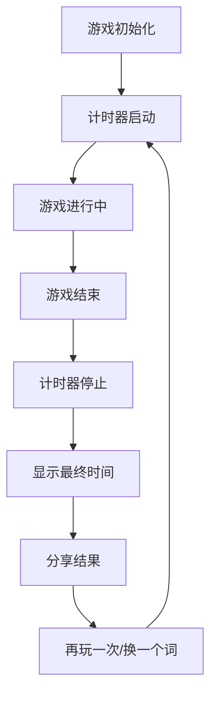
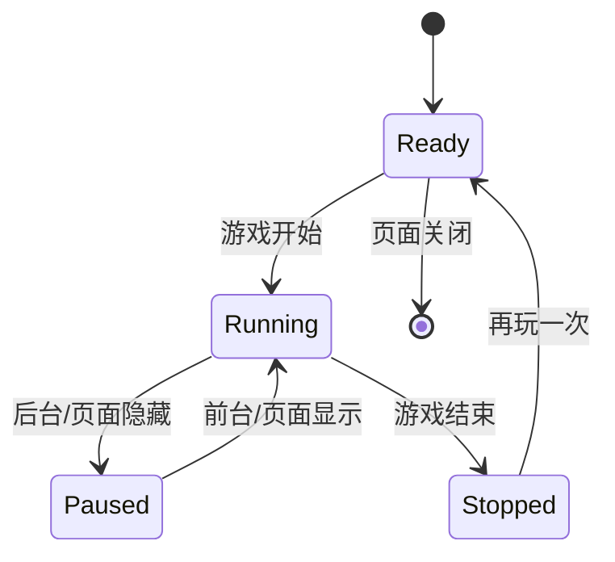

# 汉字 Wordle 计时功能交互流程设计

## 一、正常交互流程

### 1. 游戏生命周期



### 2. 核心交互步骤

| 步骤 | 触发事件 | 计时器状态 | 游戏状态 | 视觉反馈 |
|------|---------|-----------|---------|----------|
| 1 | 页面加载 | 启动 | playing | 显示 00:00 |
| 2 | 游戏进行 | 运行 | playing | 时间递增 |
| 3 | 游戏获胜 | 停止 | won | 显示最终时间 |
| 4 | 游戏失败 | 停止 | lost | 显示最终时间 |
| 5 | 再玩一次 | 重置并启动 | playing | 显示 00:00 |
| 6 | 换一个词 | 重置并启动 | playing | 显示 00:00 |

## 二、边界情况处理

### 1. 页面刷新

**场景**：用户刷新页面或重新打开浏览器

**处理策略**：
- 使用 `localStorage` 持久化计时状态
- 页面加载时检查 `localStorage` 中的计时数据
- 恢复计时状态和游戏状态

**实现代码**：
```typescript
// 保存计时状态
const saveTimerState = (state) => {
  try {
    localStorage.setItem('wordle-timer', JSON.stringify(state));
  } catch (error) {
    console.error('保存计时状态失败:', error);
  }
};

// 恢复计时状态
const loadTimerState = () => {
  try {
    const saved = localStorage.getItem('wordle-timer');
    return saved ? JSON.parse(saved) : null;
  } catch (error) {
    console.error('恢复计时状态失败:', error);
    return null;
  }
};
```

### 2. 后台运行

**场景**：用户切换到其他标签页或应用

**处理策略**：
- 监听 `visibilitychange` 事件
- 页面隐藏时暂停计时
- 页面显示时恢复计时

**实现代码**：
```typescript
useEffect(() => {
  const handleVisibilityChange = () => {
    if (document.hidden) {
      // 页面隐藏，暂停计时
      if (timer.isRunning) {
        pauseTimer();
      }
    } else {
      // 页面显示，恢复计时
      if (gameState === 'playing' && !timer.isRunning) {
        resumeTimer();
      }
    }
  };

  document.addEventListener('visibilitychange', handleVisibilityChange);
  return () => {
    document.removeEventListener('visibilitychange', handleVisibilityChange);
  };
}, [gameState, timer.isRunning]);
```

### 3. 网络中断

**场景**：网络连接断开

**处理策略**：
- 计时完全在本地计算，不依赖网络
- 网络恢复后正常运行
- 分享功能在网络恢复后可用

**实现说明**：
- 计时使用 `performance.now()`，纯本地计算
- 分享功能在网络恢复后自动恢复
- 无需特殊处理，系统会自动应对

### 4. 多标签页

**场景**：用户在多个标签页打开游戏

**处理策略**：
- 使用 `localStorage` 事件同步状态
- 确保只有一个标签页运行计时器
- 新标签页优先获取焦点

**实现代码**：
```typescript
useEffect(() => {
  const handleStorageChange = (event) => {
    if (event.key === 'wordle-timer' && event.newValue) {
      const newState = JSON.parse(event.newValue);
      // 同步计时状态
      setTimer(newState);
    }
  };

  window.addEventListener('storage', handleStorageChange);
  return () => {
    window.removeEventListener('storage', handleStorageChange);
  };
}, []);

// 标签页聚焦时检查状态
useEffect(() => {
  const handleFocus = () => {
    // 检查是否需要恢复计时
    if (gameState === 'playing' && !timer.isRunning) {
      resumeTimer();
    }
  };

  window.addEventListener('focus', handleFocus);
  return () => {
    window.removeEventListener('focus', handleFocus);
  };
}, [gameState, timer.isRunning]);
```

### 5. 游戏重置

**场景**：用户点击「再玩一次」或「换一个词」

**处理策略**：
- 重置计时器状态
- 重新启动计时
- 清除之前的计时数据

**实现代码**：
```typescript
const resetTimer = () => {
  setTimer({
    startTime: 0,
    pauseTime: 0,
    isRunning: false,
    elapsedTime: 0
  });
  // 清除本地存储
  localStorage.removeItem('wordle-timer');
};

const startTimer = () => {
  const now = performance.now();
  setTimer(prev => ({
    ...prev,
    startTime: now,
    isRunning: true
  }));
};

// 在 playAgain 和 changeWord 中调用
const playAgain = useCallback(() => {
  resetTimer();
  // 其他重置逻辑
  setTimeout(() => {
    startTimer();
  }, 50);
}, []);
```

### 6. 浏览器关闭

**场景**：用户关闭浏览器窗口

**处理策略**：
- 监听 `beforeunload` 事件
- 保存最终计时状态
- 下次打开时恢复

**实现代码**：
```typescript
useEffect(() => {
  const handleBeforeUnload = () => {
    // 保存当前计时状态
    saveTimerState(timer);
  };

  window.addEventListener('beforeunload', handleBeforeUnload);
  return () => {
    window.removeEventListener('beforeunload', handleBeforeUnload);
  };
}, [timer]);
```

### 7. 系统休眠

**场景**：电脑进入休眠状态

**处理策略**：
- 系统唤醒后重新计算时间
- 避免休眠期间的时间累积

**实现代码**：
```typescript
useEffect(() => {
  const handleWakeUp = () => {
    if (timer.isRunning) {
      // 系统唤醒，重新计算开始时间
      const now = performance.now();
      const elapsed = now - timer.startTime;
      setTimer(prev => ({
        ...prev,
        startTime: now - elapsed,
        elapsedTime: elapsed
      }));
    }
  };

  // 监听系统唤醒事件
  window.addEventListener('focus', handleWakeUp);
  return () => {
    window.removeEventListener('focus', handleWakeUp);
  };
}, [timer.isRunning, timer.startTime]);
```

## 三、交互状态管理

### 1. 状态机设计



### 2. 状态转换表

| 当前状态 | 触发事件 | 下一状态 | 动作 |
|---------|---------|---------|------|
| Ready | 游戏开始 | Running | 启动计时器 |
| Running | 页面隐藏 | Paused | 暂停计时器 |
| Paused | 页面显示 | Running | 恢复计时器 |
| Running | 游戏结束 | Stopped | 停止计时器 |
| Stopped | 再玩一次 | Ready | 重置计时器 |
| Ready | 页面关闭 | [*] | 保存状态 |

## 四、用户体验优化

### 1. 视觉反馈

**运行状态**：
- 秒数变化时轻微缩放动画
- 颜色保持红色，醒目但不刺眼

**停止状态**：
- 保持最终时间显示
- 添加轻微的高亮效果
- 不再有动画效果

**重置状态**：
- 数字重置为 00:00
- 重置时有轻微的动画效果

### 2. 错误处理

**计时异常**：
- 检测时间计算异常
- 自动重置计时器
- 显示友好的错误提示

**存储异常**：
- 检测 localStorage 错误
- 降级到内存存储
- 不影响游戏正常运行

### 3. 性能优化

**计算优化**：
- 每秒更新一次，避免频繁渲染
- 使用 `useMemo` 缓存时间计算
- 游戏结束后停止更新

**内存管理**：
- 清理定时器和事件监听器
- 避免内存泄漏
- 优化状态更新

## 五、实现注意事项

### 1. 事件监听器管理
- 正确添加和移除事件监听器
- 避免重复监听
- 处理事件监听器的依赖关系

### 2. 本地存储管理
- 定期清理过期数据
- 处理存储容量限制
- 提供降级方案

### 3. 时间计算精度
- 使用 `performance.now()` 确保精度
- 处理时间戳溢出
- 定期校准时间

### 4. 浏览器兼容性
- 测试不同浏览器的事件支持
- 提供降级方案
- 确保在移动设备上正常工作

## 六、测试场景

### 1. 功能测试

| 测试场景 | 预期结果 |
|---------|---------|
| 页面加载 | 计时器自动启动 |
| 游戏获胜 | 计时器停止，显示最终时间 |
| 游戏失败 | 计时器停止，显示最终时间 |
| 再玩一次 | 计时器重置并重新开始 |
| 换一个词 | 计时器重置并重新开始 |

### 2. 边界测试

| 测试场景 | 预期结果 |
|---------|---------|
| 页面刷新 | 计时状态恢复 |
| 后台运行 | 计时暂停，前台恢复 |
| 多标签页 | 状态同步，只有一个运行 |
| 浏览器关闭 | 状态保存，下次恢复 |
| 系统休眠 | 唤醒后时间正确 |

### 3. 异常测试

| 测试场景 | 预期结果 |
|---------|---------|
| localStorage 禁用 | 降级到内存存储 |
| 时间戳异常 | 自动重置计时器 |
| 频繁切换标签 | 状态正确同步 |

## 七、总结

本交互流程设计考虑了各种边界情况和用户场景，确保计时功能在不同环境下都能稳定运行。通过合理的状态管理、事件监听和错误处理，为用户提供流畅、可靠的计时体验。

方案注重用户体验，通过适当的视觉反馈和动画效果，增强用户对计时状态的感知。同时，通过性能优化和兼容性处理，确保在各种设备和浏览器上都能正常工作。

该设计方案为计时功能的实现提供了清晰的指导，确保功能的完整性和可靠性。