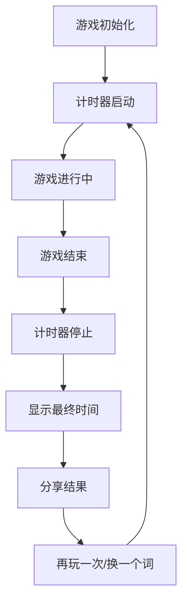
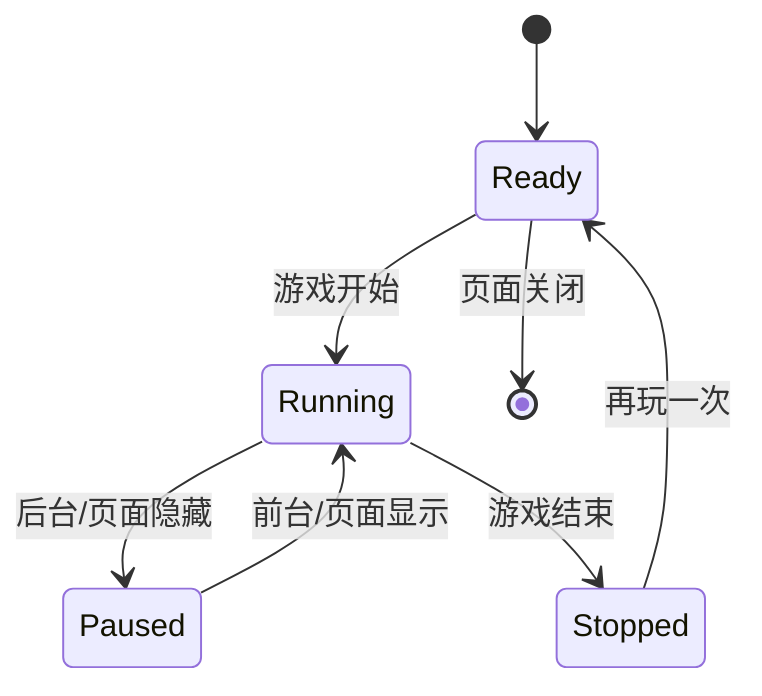

# 汉字 Wordle 计时功能完整设计方案

## 一、概述

### 1. 功能介绍

计时功能是汉字 Wordle 游戏的新增特性，用于记录用户从游戏开始到结束的用时，并在分享内容中显示。该功能参考了 `https://handle.antfu.me/` 网站的相关实现，旨在提升游戏的挑战性和社交分享价值。

### 2. 核心特性

- **自动计时**：游戏初始化时自动开始计时
- **精确停止**：游戏结束时（获胜/失败）停止计时
- **重置功能**：再玩一次/换一个词时重置计时
- **分享集成**：在文本和图片分享中包含用时信息
- **边界处理**：处理页面刷新、后台运行等场景

### 3. 技术目标

- 计时精度：误差 ≤ 0.5 秒
- 性能影响：最小化，不影响游戏体验
- 兼容性：支持主流浏览器和设备
- 用户体验：直观、流畅、可靠

## 二、技术实现

### 1. 计时启动/停止机制

**启动时机**：
- 游戏初始化时（`initGame` 调用）
- 重新开始游戏时（`playAgain` 调用）
- 切换词语时（`changeWord` 调用）

**停止时机**：
- 游戏获胜时（`gameState` 变为 `'won'`）
- 游戏失败时（`gameState` 变为 `'lost'`）
- 用户主动放弃时（点击相关按钮）

**技术实现**：
- 使用 `useEffect` 监听 `gameState` 变化
- 在 `useGame` hook 中添加计时器状态管理
- 实现 `startTimer`、`stopTimer`、`resetTimer` 函数

### 2. 时间计算方法

**核心算法**：
- 使用 `performance.now()` 作为时间戳源（高精度）
- 记录开始时间 `startTime` 和暂停时间 `pauseTime`
- 计算总耗时：`elapsedTime = pauseTime - startTime`

**状态管理**：
```typescript
const [timer, setTimer] = useState({
  startTime: 0,
  pauseTime: 0,
  isRunning: false,
  elapsedTime: 0
});
```

**时间格式化**：
- 转换毫秒为分:秒格式
- 处理两位数显示（00:00 格式）

### 3. 精度保障措施

**精度控制**：
- 使用 `performance.now()` 而非 `Date.now()`（精度从毫秒级提升到微秒级）
- 避免使用 `setInterval`（可能存在计时偏差）
- 使用 `requestAnimationFrame` 进行平滑更新

**误差控制**：
- 误差范围目标：≤ 0.5 秒
- 实现防抖动和去重处理
- 定期同步真实时间戳

**性能优化**：
- 游戏进行中：1000ms 更新一次（秒级精度）
- 游戏结束后：停止更新，保持最终时间

## 三、视觉设计

### 1. 整体布局

**位置**：
- 位于 `header` 组件内
- 标题 `<h1>` 和副标题 `<p>` 之间
- 居中显示

**结构**：
```jsx
<header className="w-full text-center py-4 sm:py-5 border-b border-gray-200 px-4">
  <h1 className="text-2xl sm:text-3xl font-bold text-gray-900 mb-1">汉字 Wordle</h1>
  {/* 计时器位置 */}
  <div className="timer-container">
    <span className="timer">00:00</span>
  </div>
  <p className="text-sm sm:text-base text-gray-600">猜四字成语</p>
  {/* 其他按钮 */}
</header>
```

### 2. 视觉样式

**颜色方案**：
- 主色：`#ef4444`（红色，与错误提示一致）
- 背景：透明（与 header 背景一致）
- 边框：无
- 阴影：无

**字体样式**：
- 字体：`font-mono`（等宽字体，数字对齐）
- 大小：`text-lg sm:text-xl`（响应式）
- 粗细：`font-semibold`（醒目）
- 间距：`tracking-wider`（数字间距适中）

**动画效果**：
- 秒数变化：轻微的缩放动画
- 停止状态：轻微的高亮效果
- 过渡：`transition-all duration-200`（平滑过渡）

### 3. 响应式设计

**断点设计**：
- 移动端（< 640px）：`text-lg`
- 平板/桌面（≥ 640px）：`text-xl`

**间距调整**：
- 移动端：`mb-1 mt-1`
- 平板/桌面：`mb-1.5 mt-1.5`

### 4. 状态样式

**运行状态**：
- 颜色：`#ef4444`（红色）
- 动画：秒数变化时 `scale-105` 然后恢复

**停止状态**：
- 颜色：`#ef4444`（保持红色）
- 效果：添加 `opacity-90` 效果

**重置状态**：
- 颜色：`#ef4444`（红色）
- 动画：`scale-95` 然后恢复到 `scale-100`

### 5. 具体实现代码

**CSS 样式**：
```css
/* App.css */
.timer-container {
  display: flex;
  justify-content: center;
  align-items: center;
  margin: 0.25rem 0;
}

.timer {
  font-family: monospace;
  font-size: 1.125rem;
  font-weight: 600;
  color: #ef4444;
  letter-spacing: 0.05em;
  transition: all 0.2s ease;
}

@media (min-width: 640px) {
  .timer {
    font-size: 1.25rem;
  }
  
  .timer-container {
    margin: 0.375rem 0;
  }
}

.timer.running {
  /* 运行状态样式 */
}

.timer.stopped {
  opacity: 0.9;
}

.timer.animating {
  transform: scale(1.05);
}
```

**React 组件实现**：
```jsx
// 计时器组件
function Timer({ time, isRunning }) {
  const [isAnimating, setIsAnimating] = useState(false);
  const [lastTime, setLastTime] = useState(time);

  // 检测时间变化，触发动画
  useEffect(() => {
    if (time !== lastTime) {
      setIsAnimating(true);
      setTimeout(() => setIsAnimating(false), 200);
      setLastTime(time);
    }
  }, [time, lastTime]);

  return (
    <div className="timer-container">
      <span className={`timer ${isRunning ? 'running' : 'stopped'} ${isAnimating ? 'animating' : ''}`}>
        {time}
      </span>
    </div>
  );
}

// 在 App.tsx 中使用
<header className="w-full text-center py-4 sm:py-5 border-b border-gray-200 px-4">
  <h1 className="text-2xl sm:text-3xl font-bold text-gray-900 mb-1">汉字 Wordle</h1>
  <Timer 
    time={formattedTime} 
    isRunning={timerIsRunning} 
  />
  <p className="text-sm sm:text-base text-gray-600">猜四字成语</p>
  {/* 其他按钮 */}
</header>
```

## 四、交互流程

### 1. 正常交互流程

**游戏生命周期**：


**核心交互步骤**：

| 步骤 | 触发事件 | 计时器状态 | 游戏状态 | 视觉反馈 |
|------|---------|-----------|---------|----------|
| 1 | 页面加载 | 启动 | playing | 显示 00:00 |
| 2 | 游戏进行 | 运行 | playing | 时间递增 |
| 3 | 游戏获胜 | 停止 | won | 显示最终时间 |
| 4 | 游戏失败 | 停止 | lost | 显示最终时间 |
| 5 | 再玩一次 | 重置并启动 | playing | 显示 00:00 |
| 6 | 换一个词 | 重置并启动 | playing | 显示 00:00 |

### 2. 边界情况处理

**页面刷新**：
- 使用 `localStorage` 持久化计时状态
- 页面加载时检查 `localStorage` 中的计时数据
- 恢复计时状态和游戏状态

**后台运行**：
- 监听 `visibilitychange` 事件
- 页面隐藏时暂停计时
- 页面显示时恢复计时

**网络中断**：
- 计时完全在本地计算，不依赖网络
- 网络恢复后正常运行
- 分享功能在网络恢复后可用

**多标签页**：
- 使用 `localStorage` 事件同步状态
- 确保只有一个标签页运行计时器
- 新标签页优先获取焦点

**浏览器关闭**：
- 监听 `beforeunload` 事件
- 保存最终计时状态
- 下次打开时恢复

**系统休眠**：
- 系统唤醒后重新计算时间
- 避免休眠期间的时间累积

### 3. 状态管理

**状态机设计**：


**状态转换表**：

| 当前状态 | 触发事件 | 下一状态 | 动作 |
|---------|---------|---------|------|
| Ready | 游戏开始 | Running | 启动计时器 |
| Running | 页面隐藏 | Paused | 暂停计时器 |
| Paused | 页面显示 | Running | 恢复计时器 |
| Running | 游戏结束 | Stopped | 停止计时器 |
| Stopped | 再玩一次 | Ready | 重置计时器 |
| Ready | 页面关闭 | [*] | 保存状态 |

### 4. 实现代码示例

**本地存储**：
```typescript
// 保存计时状态
const saveTimerState = (state) => {
  try {
    localStorage.setItem('wordle-timer', JSON.stringify(state));
  } catch (error) {
    console.error('保存计时状态失败:', error);
  }
};

// 恢复计时状态
const loadTimerState = () => {
  try {
    const saved = localStorage.getItem('wordle-timer');
    return saved ? JSON.parse(saved) : null;
  } catch (error) {
    console.error('恢复计时状态失败:', error);
    return null;
  }
};
```

**后台运行处理**：
```typescript
useEffect(() => {
  const handleVisibilityChange = () => {
    if (document.hidden) {
      // 页面隐藏，暂停计时
      if (timer.isRunning) {
        pauseTimer();
      }
    } else {
      // 页面显示，恢复计时
      if (gameState === 'playing' && !timer.isRunning) {
        resumeTimer();
      }
    }
  };

  document.addEventListener('visibilitychange', handleVisibilityChange);
  return () => {
    document.removeEventListener('visibilitychange', handleVisibilityChange);
  };
}, [gameState, timer.isRunning]);
```

## 五、数据整合

### 1. 数据结构设计

**核心数据**：
- `elapsedTime`：总耗时（毫秒）
- `isRunning`：是否运行中
- `formattedTime`：格式化的时间字符串（MM:SS）

**数据传递**：
```typescript
// useGame hook 导出
export function useGame() {
  // ... 现有状态
  
  const [timer, setTimer] = useState({
    startTime: 0,
    pauseTime: 0,
    isRunning: false,
    elapsedTime: 0
  });
  
  // 计算格式化时间
  const formattedTime = useMemo(() => {
    const totalSeconds = Math.floor(timer.elapsedTime / 1000);
    const minutes = Math.floor(totalSeconds / 60);
    const seconds = totalSeconds % 60;
    return `${minutes.toString().padStart(2, '0')}:${seconds.toString().padStart(2, '0')}`;
  }, [timer.elapsedTime]);
  
  return {
    // ... 现有返回值
    elapsedTime: timer.elapsedTime,
    formattedTime,
    isTimerRunning: timer.isRunning
  };
}
```

### 2. 文本分享整合

**分享文本格式**：
```
汉兜 · 第 XXX 期
[提示状态标识]

[Emoji 矩阵]

[游戏结果]
用时 X分Y秒
```

**实现代码**：
```typescript
// src/utils/share.ts
export function generateShareText(
  grid: CellData[][],
  attempts: number,
  isWin: boolean,
  hintUsage: HintUsage,
  elapsedTime: number // 新增参数
): string {
  const dayNumber = getDayNumber();
  let text = `汉兜 · 第 ${dayNumber} 期\n`;

  // 添加提示状态
  if (hintUsage.used) {
    if (hintUsage.level === 1) {
      text += '🔤 拼音提示\n';
    } else if (hintUsage.level === 2) {
      text += '💡 汉字提示\n';
    }
  } else {
    text += '🏆 无提示辅助\n';
  }

  text += '\n';

  // 生成 emoji 矩阵
  const matrix = grid
    .filter(row => row.some(cell => cell.charState !== 'empty'))
    .map(row => 
      row.map(cell => {
        if (cell.charState === 'correct') return '🟩';
        if (cell.charState === 'present') return '🟨';
        return '⬜';
      }).join('')
    ).join('\n');

  text += matrix + '\n';

  // 添加结果
  if (isWin) {
    text += `\n用了 ${attempts} 次猜中！`;
  } else {
    text += '\n没猜出来，下次加油！';
  }

  // 添加计时信息
  const totalSeconds = Math.floor(elapsedTime / 1000);
  const minutes = Math.floor(totalSeconds / 60);
  const seconds = totalSeconds % 60;
  text += `\n用时 ${minutes}分${seconds}秒`;

  return text;
}
```

### 3. 图片分享整合

**图片内容设计**：
- 顶部：游戏标题（汉兜 · 第 X 期）
- 上部：提示状态徽章
- 中部：游戏结果网格
- 下部：游戏结果文字
- 底部：计时信息

**实现代码**：
```typescript
// src/utils/imageShare.ts
export function createShareImageElement(
  grid: CellData[][],
  attempts: number,
  isWin: boolean,
  hintUsage: HintUsage,
  elapsedTime: number // 新增参数
): HTMLElement {
  // ... 现有代码

  // 添加计时信息
  const timeInfo = document.createElement('div');
  timeInfo.style.cssText = `
    text-align: center;
    font-size: 14px;
    opacity: 0.8;
  `;
  const totalSeconds = Math.floor(elapsedTime / 1000);
  const minutes = Math.floor(totalSeconds / 60);
  const seconds = totalSeconds % 60;
  timeInfo.textContent = `用时 ${minutes}:${seconds.toString().padStart(2, '0')}`;
  container.appendChild(timeInfo);

  // ... 现有代码
  return container;
}
```

### 4. 数据一致性保障

**时间格式化**：
- 文本分享：`X分Y秒`
- 图片分享：`X:Y`
- 内部存储：毫秒数

**统一处理函数**：
```typescript
// 格式化时间为文本格式
export function formatTimeForText(elapsedTime: number): string {
  const totalSeconds = Math.floor(elapsedTime / 1000);
  const minutes = Math.floor(totalSeconds / 60);
  const seconds = totalSeconds % 60;
  return `${minutes}分${seconds}秒`;
}

// 格式化时间为图片格式
export function formatTimeForImage(elapsedTime: number): string {
  const totalSeconds = Math.floor(elapsedTime / 1000);
  const minutes = Math.floor(totalSeconds / 60);
  const seconds = totalSeconds % 60;
  return `${minutes}:${seconds.toString().padStart(2, '0')}`;
}
```

## 六、性能与兼容性

### 1. 性能优化策略

**计算性能优化**：
- 使用 `performance.now()` 而非 `Date.now()`（精度更高）
- 避免使用 `setInterval`，改用 `requestAnimationFrame`
- 游戏结束后停止计时更新

**渲染优化**：
- 使用 `useMemo` 缓存时间计算结果
- 限制更新频率：每秒更新一次
- 避免不必要的重渲染

**内存优化**：
- 清理定时器和事件监听器
- 避免内存泄漏
- 优化状态更新

### 2. 浏览器兼容性

**支持的浏览器**：
- Chrome 60+
- Firefox 55+
- Safari 10.1+
- Edge 79+

**降级方案**：
- `performance.now()` → `Date.now()`
- `requestAnimationFrame` → `setTimeout`
- `localStorage` → 内存存储
- `visibilitychange` → `focus`/`blur` 事件

**功能降级**：
- 计时精度降级：从毫秒级到秒级
- 本地存储降级：页面刷新后不恢复计时
- 后台暂停降级：后台运行时继续计时

### 3. 设备适配

**响应式设计**：
- 移动端 (< 640px)：`text-lg` 字体
- 平板 (640px - 1024px)：`text-xl` 字体
- 桌面 (> 1024px)：`text-xl` 字体

**移动设备优化**：
- 优化触摸交互
- 避免误触
- 响应式按钮大小
- 电池优化（减少后台计算）
- 内存限制适应

**高分辨率设备**：
- 支持高 DPI 屏幕
- 清晰的字体渲染
- 适当的动画效果

### 4. 网络环境考虑

**离线支持**：
- 计时完全在本地计算
- 不依赖网络连接
- 分享功能在网络恢复后可用

**离线存储**：
- 使用 `localStorage` 存储游戏状态
- 页面刷新后恢复计时
- 支持离线游戏

## 七、测试计划

### 1. 测试目标

- **功能验证**：确保计时功能的基本操作正常
- **精度验证**：确保计时的准确性和稳定性
- **用户体验验证**：确保计时功能的界面和交互符合预期
- **兼容性验证**：确保在不同设备和浏览器上的表现一致
- **性能验证**：确保计时功能不会影响游戏的整体性能

### 2. 测试场景

**功能测试**：
- 游戏初始化：计时器自动启动
- 游戏获胜：计时器停止，显示最终时间
- 游戏失败：计时器停止，显示最终时间
- 再玩一次：计时器重置并重新开始
- 换一个词：计时器重置并重新开始
- 文本分享：包含计时信息
- 图片分享：包含计时信息

**精度测试**：
- 短时间测试：10 秒误差 ≤ 0.5 秒
- 长时间测试：5 分钟误差 ≤ 1 秒
- 后台切换测试：误差 ≤ 1 秒
- 页面刷新测试：误差 ≤ 1 秒

**边界测试**：
- 页面刷新：计时状态恢复
- 后台运行：计时暂停，前台恢复
- 多标签页：状态同步，只有一个运行
- 浏览器关闭：状态保存，下次恢复
- 系统休眠：唤醒后时间正确
- 计时未开始：显示 0分0秒
- 计时异常：自动重置

**兼容性测试**：
- Chrome：所有功能正常
- Firefox：所有功能正常
- Safari：所有功能正常
- Edge：所有功能正常
- 移动端：所有功能正常，界面适配
- 平板：所有功能正常，界面适配

**性能测试**：
- 启动性能：页面加载时间 < 2s，初始化时间 < 100ms
- 运行性能：内存使用 < 50MB，CPU 使用率 < 5%
- 响应性能：状态更新 < 100ms，分享操作 < 500ms
- 帧率测试：保持 60 FPS

### 3. 测试方法

**自动化测试**：
- 使用 Jest 进行单元测试
- 使用 Cypress 进行端到端测试
- 测试核心功能和边界情况

**手动测试**：
- 在真实设备上测试
- 测试各种网络环境
- 测试不同屏幕尺寸

**性能测试**：
- 使用 Lighthouse 进行性能分析
- 测量启动时间和运行性能
- 优化性能瓶颈

## 八、实现步骤

### 1. 状态管理改造

1. **修改 useGame.ts**：
   - 添加计时器状态
   - 实现计时相关函数
   - 导出 `elapsedTime` 和 `formattedTime`

2. **修改 App.tsx**：
   - 解构计时相关状态
   - 在分享函数中传递计时数据

### 2. UI 集成

1. **添加计时器组件**：
   - 创建 Timer 组件
   - 实现视觉样式
   - 添加动画效果

2. **集成到页面**：
   - 在 header 中添加计时器
   - 实现响应式设计
   - 测试视觉效果

### 3. 分享功能集成

1. **修改 share.ts**：
   - 添加 `elapsedTime` 参数
   - 在分享文本中添加计时信息

2. **修改 imageShare.ts**：
   - 添加 `elapsedTime` 参数
   - 在分享图片中添加计时信息

### 4. 测试与优化

1. **功能测试**：
   - 验证所有功能正常
   - 测试边界情况

2. **精度测试**：
   - 验证计时准确性
   - 测试长时间运行

3. **兼容性测试**：
   - 测试不同浏览器
   - 测试不同设备

4. **性能优化**：
   - 优化计算性能
   - 优化渲染性能

## 九、风险评估

| 风险 | 可能性 | 影响 | 应对策略 |
|------|--------|------|----------|
| 计时精度偏差 | 低 | 中 | 使用 `performance.now()`，定期校准 |
| 浏览器兼容性 | 低 | 中 | 实现降级方案 |
| 后台运行问题 | 中 | 中 | 监听 `visibilitychange` 事件 |
| 页面刷新数据丢失 | 中 | 高 | 使用 `localStorage` 持久化 |
| 内存泄漏 | 低 | 中 | 清理定时器和事件监听器 |
| 性能影响 | 低 | 低 | 优化计算和渲染 |

## 十、总结

本计时功能设计方案通过全面的技术实现、视觉设计、交互流程、数据整合、性能优化和测试计划，确保了计时功能的准确性、可靠性和用户体验。

核心亮点：
- **高精度计时**：使用 `performance.now()` 确保微秒级精度
- **智能边界处理**：妥善处理页面刷新、后台运行等场景
- **无缝分享集成**：在文本和图片分享中包含用时信息
- **优秀的用户体验**：直观的视觉设计和流畅的交互
- **广泛的兼容性**：支持主流浏览器和设备

该功能将为汉字 Wordle 游戏增添新的维度，提升用户的游戏体验和社交分享价值。通过严格的测试和优化，确保功能的质量和稳定性。