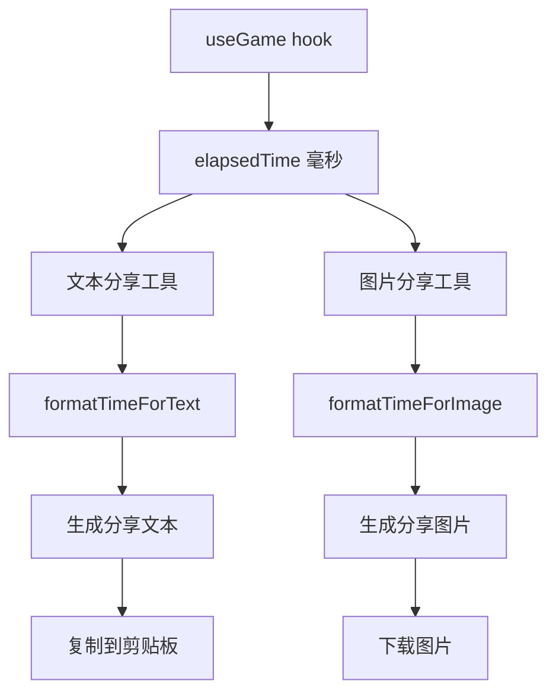

# 汉字 Wordle 计时功能数据整合方案

## 一、数据结构设计

### 1. 计时数据结构

**核心数据**：
- `elapsedTime`：总耗时（毫秒）
- `isRunning`：是否运行中
- `formattedTime`：格式化的时间字符串（MM:SS）

**数据传递**：
```typescript
// useGame hook 导出
export function useGame() {
  // ... 现有状态
  
  const [timer, setTimer] = useState({
    startTime: 0,
    pauseTime: 0,
    isRunning: false,
    elapsedTime: 0
  });
  
  // 计算格式化时间
  const formattedTime = useMemo(() => {
    const totalSeconds = Math.floor(timer.elapsedTime / 1000);
    const minutes = Math.floor(totalSeconds / 60);
    const seconds = totalSeconds % 60;
    return `${minutes.toString().padStart(2, '0')}:${seconds.toString().padStart(2, '0')}`;
  }, [timer.elapsedTime]);
  
  return {
    // ... 现有返回值
    elapsedTime: timer.elapsedTime,
    formattedTime,
    isTimerRunning: timer.isRunning
  };
}
```

### 2. 分享数据结构

**文本分享**：
- 包含计时信息的文本字符串
- 格式：`用时 X分Y秒`

**图片分享**：
- 包含计时信息的图片
- 格式：`用时 X:Y`

## 二、文本分享整合

### 1. 分享文本格式

**标准格式**：
```
汉兜 · 第 XXX 期
[提示状态标识]

[Emoji 矩阵]

[游戏结果]
用时 X分Y秒
```

**示例**：
```
汉兜 · 第 123 期
🏆 无提示辅助

⬜⬜⬜🟨
🟩⬜⬜⬜
⬜🟨⬜⬜
🟩🟩🟩🟩

用了 4 次猜中！
用时 2分30秒
```

### 2. 实现代码

**修改分享工具函数**：
```typescript
// src/utils/share.ts
export function generateShareText(
  grid: CellData[][],
  attempts: number,
  isWin: boolean,
  hintUsage: HintUsage,
  elapsedTime: number // 新增参数
): string {
  const dayNumber = getDayNumber();
  let text = `汉兜 · 第 ${dayNumber} 期\n`;

  // 添加提示状态
  if (hintUsage.used) {
    if (hintUsage.level === 1) {
      text += '🔤 拼音提示\n';
    } else if (hintUsage.level === 2) {
      text += '💡 汉字提示\n';
    }
  } else {
    text += '🏆 无提示辅助\n';
  }

  text += '\n';

  // 生成 emoji 矩阵
  const matrix = grid
    .filter(row => row.some(cell => cell.charState !== 'empty'))
    .map(row => 
      row.map(cell => {
        if (cell.charState === 'correct') return '🟩';
        if (cell.charState === 'present') return '🟨';
        return '⬜';
      }).join('')
    ).join('\n');

  text += matrix + '\n';

  // 添加结果
  if (isWin) {
    text += `\n用了 ${attempts} 次猜中！`;
  } else {
    text += '\n没猜出来，下次加油！';
  }

  // 添加计时信息
  const totalSeconds = Math.floor(elapsedTime / 1000);
  const minutes = Math.floor(totalSeconds / 60);
  const seconds = totalSeconds % 60;
  text += `\n用时 ${minutes}分${seconds}秒`;

  return text;
}
```

**在 App.tsx 中调用**：
```typescript
const handleTextShare = () => {
  const actualAttempts = grid.filter(row => 
    row.some(cell => cell.charState !== 'empty')
  ).length;
  
  const text = generateShareText(
    grid,
    actualAttempts,
    gameState === 'won',
    hintUsage,
    elapsedTime // 传递计时数据
  );
  
  copyToClipboard(text).then(success => {
    if (success) {
      showToast('已复制到剪贴板', 'warning');
    } else {
      showToast('复制失败，请手动复制', 'error');
    }
  });
};
```

## 三、图片分享整合

### 1. 图片内容设计

**图片布局**：
- 顶部：游戏标题（汉兜 · 第 X 期）
- 上部：提示状态徽章
- 中部：游戏结果网格
- 下部：游戏结果文字
- 底部：计时信息

**计时信息格式**：
- 位置：结果文字下方
- 格式：`用时 X:Y`
- 样式：与结果文字一致

### 2. 实现代码

**修改图片生成函数**：
```typescript
// src/utils/imageShare.ts
export function createShareImageElement(
  grid: CellData[][],
  attempts: number,
  isWin: boolean,
  hintUsage: HintUsage,
  elapsedTime: number // 新增参数
): HTMLElement {
  const container = document.createElement('div');
  container.style.cssText = `
    width: 320px;
    padding: 24px;
    background: linear-gradient(135deg, #667eea 0%, #764ba2 100%);
    border-radius: 16px;
    font-family: -apple-system, BlinkMacSystemFont, 'Segoe UI', Roboto, sans-serif;
    color: white;
    box-shadow: 0 10px 40px rgba(0, 0, 0, 0.2);
  `;

  // 标题
  const title = document.createElement('div');
  title.style.cssText = `
    text-align: center;
    font-size: 20px;
    font-weight: bold;
    margin-bottom: 12px;
  `;
  title.textContent = `汉兜 · 第 ${getDayNumber()} 期`;
  container.appendChild(title);

  // 提示状态徽章
  // ... 现有代码

  // 游戏网格
  // ... 现有代码

  // 结果文本
  const result = document.createElement('div');
  result.style.cssText = `
    text-align: center;
    font-size: 16px;
    opacity: 0.9;
    margin-bottom: 8px;
  `;
  result.textContent = isWin 
    ? `用了 ${attempts} 次猜中！🎉`
    : `没猜出来，下次加油！💪`;
  container.appendChild(result);

  // 添加计时信息
  const timeInfo = document.createElement('div');
  timeInfo.style.cssText = `
    text-align: center;
    font-size: 14px;
    opacity: 0.8;
  `;
  const totalSeconds = Math.floor(elapsedTime / 1000);
  const minutes = Math.floor(totalSeconds / 60);
  const seconds = totalSeconds % 60;
  timeInfo.textContent = `用时 ${minutes}:${seconds.toString().padStart(2, '0')}`;
  container.appendChild(timeInfo);

  // 隐藏并添加到 body
  container.style.position = 'absolute';
  container.style.left = '-9999px';
  document.body.appendChild(container);

  return container;
}
```

**在 App.tsx 中调用**：
```typescript
const handleImageShare = () => {
  const actualAttempts = grid.filter(row => 
    row.some(cell => cell.charState !== 'empty')
  ).length;
  
  const shareElement = createShareImageElement(
    grid,
    actualAttempts,
    gameState === 'won',
    hintUsage,
    elapsedTime // 传递计时数据
  );
  
  saveShareImage(shareElement).then(success => {
    if (success) {
      showToast('图片已保存', 'warning');
    } else {
      showToast('保存图片失败，请重试', 'error');
    }
  });
};
```

## 四、数据一致性保障

### 1. 数据格式统一

**时间格式化**：
- 文本分享：`X分Y秒`
- 图片分享：`X:Y`
- 内部存储：毫秒数

**统一处理函数**：
```typescript
// 格式化时间为文本格式
export function formatTimeForText(elapsedTime: number): string {
  const totalSeconds = Math.floor(elapsedTime / 1000);
  const minutes = Math.floor(totalSeconds / 60);
  const seconds = totalSeconds % 60;
  return `${minutes}分${seconds}秒`;
}

// 格式化时间为图片格式
export function formatTimeForImage(elapsedTime: number): string {
  const totalSeconds = Math.floor(elapsedTime / 1000);
  const minutes = Math.floor(totalSeconds / 60);
  const seconds = totalSeconds % 60;
  return `${minutes}:${seconds.toString().padStart(2, '0')}`;
}
```

### 2. 数据传递流程



## 五、边界情况处理

### 1. 计时未开始

**场景**：用户在计时开始前分享

**处理策略**：
- 显示 `用时 0分0秒`
- 确保分享内容完整

### 2. 计时异常

**场景**：计时数据异常（负数或过大）

**处理策略**：
- 检测异常数据
- 重置为 `0分0秒`
- 确保分享功能正常

### 3. 分享时机

**场景**：用户在游戏进行中分享

**处理策略**：
- 暂停计时
- 生成分享内容
- 恢复计时

## 六、实现步骤

### 1. 状态管理改造

1. **修改 useGame.ts**：
   - 添加计时器状态
   - 实现计时相关函数
   - 导出 `elapsedTime` 和 `formattedTime`

2. **修改 App.tsx**：
   - 解构计时相关状态
   - 在分享函数中传递计时数据

### 2. 分享工具改造

1. **修改 share.ts**：
   - 添加 `elapsedTime` 参数
   - 在分享文本中添加计时信息

2. **修改 imageShare.ts**：
   - 添加 `elapsedTime` 参数
   - 在分享图片中添加计时信息

### 3. 测试验证

1. **功能测试**：
   - 验证文本分享包含计时信息
   - 验证图片分享包含计时信息
   - 验证计时数据准确性

2. **边界测试**：
   - 测试计时未开始时的分享
   - 测试计时异常时的处理
   - 测试游戏进行中的分享

## 七、兼容性考虑

### 1. 向后兼容

**旧版本分享**：
- 不影响现有的分享功能
- 新功能作为增强，而非替换

**数据结构**：
- 保持现有分享函数的参数结构
- 新增参数为可选

### 2. 跨平台兼容

**不同设备**：
- 确保计时格式在不同设备上一致
- 适配不同屏幕尺寸的图片分享

**不同浏览器**：
- 确保时间计算在不同浏览器中准确
- 测试分享功能在主流浏览器中的表现

## 八、性能优化

### 1. 计算优化

- 使用 `useMemo` 缓存时间计算
- 避免重复的时间格式化
- 游戏结束后停止时间更新

### 2. 存储优化

- 只在必要时保存计时状态
- 清理过期的本地存储数据
- 优化存储结构，减少数据大小

## 九、总结

本数据整合方案通过统一的数据源和格式处理，确保计时信息在文本分享和图片分享中保持一致。通过合理的数据传递流程和边界情况处理，确保功能的可靠性和用户体验的一致性。

方案考虑了向后兼容和跨平台兼容，确保在不同设备和浏览器上都能正常工作。通过性能优化，确保计时功能不会影响游戏的整体性能。

该方案为计时功能与分享系统的集成提供了清晰的指导，确保功能的完整性和可靠性。